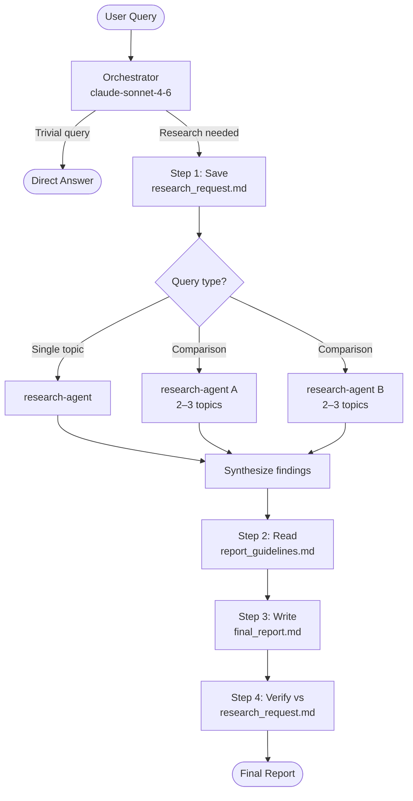
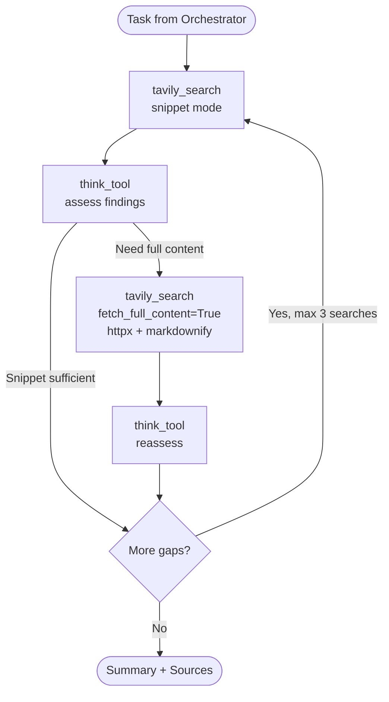
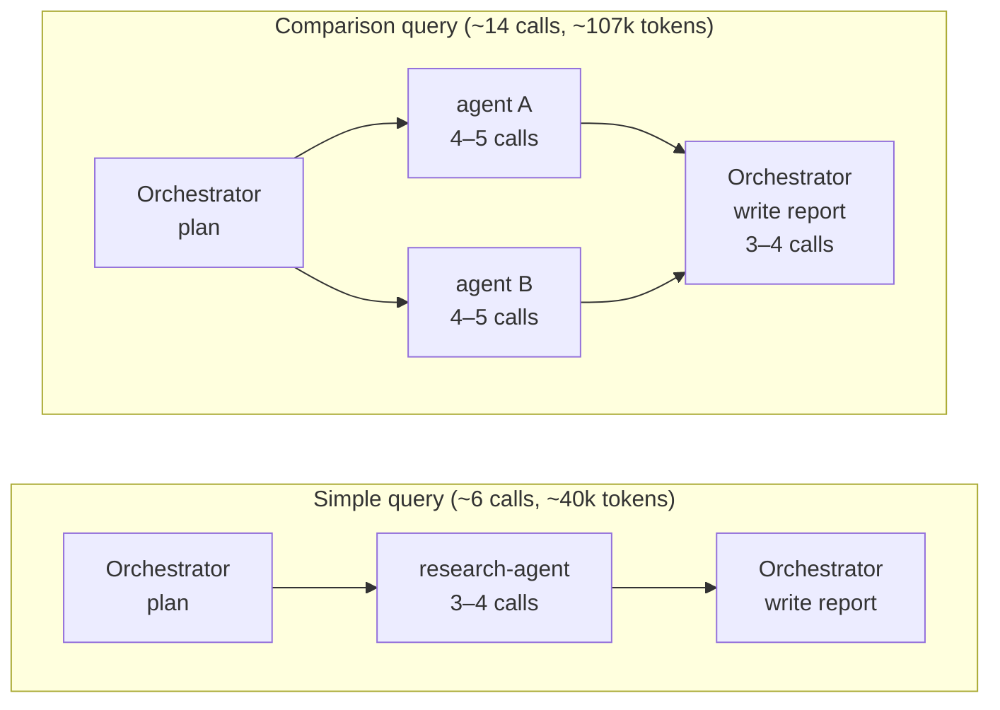

# Deep Research Agent

A multi-agent deep research assistant built with [deepagents](https://github.com/langchain-ai/deepagents) and LangGraph. Given a query, it autonomously searches the web, synthesizes findings, and produces a structured report with cited sources.

## Architecture

### Agent Flow



### Research Agent Loop



### LLM Call Budget



## Stack

| Component | Choice |
|---|---|
| LLM (primary) | `claude-sonnet-4-6` (Anthropic) |
| LLM (fallback) | `gpt-5.2` (OpenAI) |
| Agent framework | `deepagents` + LangGraph |
| Web search | Tavily API |
| Full page fetch | `httpx` + `markdownify` |
| Checkpointing | `InMemorySaver` (default) / PostgreSQL |

## Setup

```bash
# Install dependencies
uv sync

# Copy and fill environment variables
cp .env.example .env
```

Required keys in `.env`:

```env
ANTHROPIC_API_KEY=...   # primary LLM
OPENAI_API_KEY=...      # fallback LLM
TAVILY_API_KEY=...      # web search
```

Optional:

```env
LANGSMITH_API_KEY=...         # observability
LANGGRAPH_DATABASE_URL=...    # persistent checkpoints (PostgreSQL)
MODEL_NAME=claude-sonnet-4-6
MAX_CONCURRENT_RESEARCH_UNITS=2
MAX_SUBAGENTS_ITERATIONS=1
RECURSION_LIMIT=50
```

## Running

**Integration test (CLI):**

```bash
python tests/run_agent.py "what is context engineering for AI agents?"
```

**LangGraph dev server:**

```bash
langgraph up
```

## Performance Benchmarks

| Query type | LLM calls | Total tokens | Latency |
|---|---|---|---|
| Simple / single-topic | ~6 | ~40k | ~60s |
| Comparison / deep research | ~14 | ~107k | ~94s |
