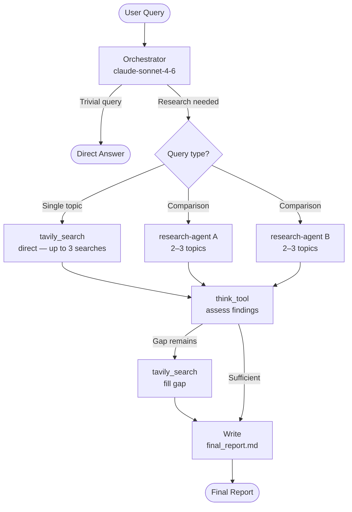
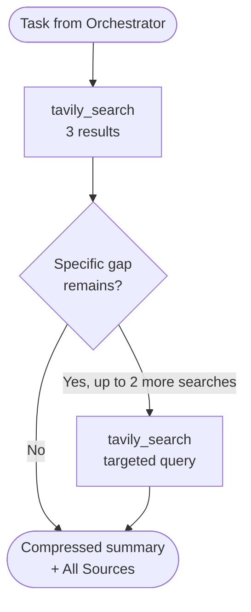
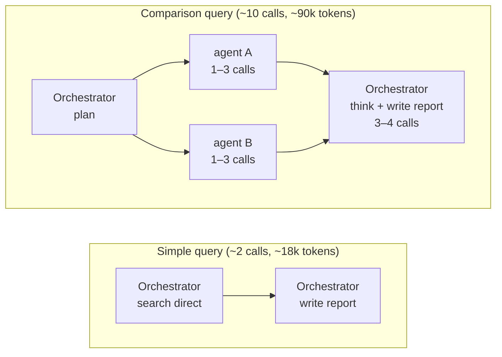

# Deep Research Agent

A multi-agent deep research assistant built with [deepagents](https://github.com/langchain-ai/deepagents) and LangGraph. Given a query, it autonomously searches the web, synthesizes findings, and produces a structured report with cited sources.


## Architecture

### Agent Flow



### Research Agent Loop



### LLM Call Budget



## Stack

| Component | Choice |
|---|---|
| LLM (primary) | `claude-sonnet-4-6` (Anthropic) |
| LLM (fallback) | `gpt-5.2` (OpenAI) |
| Agent framework | `deepagents` + LangGraph |
| Web search | Tavily API |
| Full page fetch | `httpx` + `markdownify` |
| Checkpointing | `InMemorySaver` (default) / PostgreSQL |
| API layer | FastAPI + SSE streaming |
| Frontend | Streamlit |

## Setup

```bash
# Install dependencies
uv sync

# Copy and fill environment variables
cp .env.example .env
```

Required keys in `.env`:

```env
ANTHROPIC_API_KEY=...   # primary LLM
OPENAI_API_KEY=...      # fallback LLM
TAVILY_API_KEY=...      # web search
```

Optional:

```env
LANGSMITH_API_KEY=...         # observability
LANGGRAPH_DATABASE_URL=...    # persistent checkpoints (PostgreSQL)
MODEL_NAME=claude-sonnet-4-6
SUBAGENT_MODEL_NAME=claude-sonnet-4-6
MAX_CONCURRENT_RESEARCH_UNITS=2
MAX_SUBAGENTS_ITERATIONS=1
RECURSION_LIMIT=50
```

## Running

**Integration test (CLI):**

```bash
python tests/run_agent.py "what is context engineering for AI agents?"
```

**LangGraph dev server:**

```bash
PYTHONUTF8=1 uv run langgraph dev --no-reload --allow-blocking
```

**FastAPI server:**

```bash
uv run uvicorn backend.api:app --reload
```

## Example Output

See [`examples/final_report.md`](examples/final_report.md) for a sample report generated by the agent.

## Performance Benchmarks

| Query type | LLM calls | Total tokens | Latency |
|---|---|---|---|
| Simple / single-topic | ~2 | ~18k | ~15–20s |
| Comparison / deep research | ~10 | ~90k | ~75s |

## Framework Comparison

Benchmarked against an equivalent single-agent implementation using [agno](https://github.com/agno-agi/agno) on the same query and model family.

| Metric | deep-agent-v1 | agno (single-agent) |
|---|---|---|
| Model | claude-sonnet-4-6 | claude-sonnet-4-5 |
| Total tokens | ~62k | ~51k |
| Latency | ~113s | ~103s |
| TTFT | 73ms | 1.566s |
| Sources cited | 7–8 | 6 |
| Output tokens | 6,742 | 4,699 |

**Trade-offs:** agno produces more concise output at lower cost for single-topic queries. deep-agent-v1 has significantly lower TTFT (better streaming UX), richer output, and scales to parallel multi-agent research for comparison queries — where agno's single-agent approach would run searches sequentially.

## Roadmap

### Phase 1 — Token & Cost Optimization ✅
- [x] Compress sub-agent findings before passing to orchestrator (research-agent returns bullet-point summary)
- [x] Bypass sub-agent for single-topic queries — orchestrator searches directly with `tavily_search`
- [x] Hard cap on `tavily_search` calls via closure counter (enforced at code level, not just prompt)
- [x] Sub-agent search limit raised to 3; sources section exempt from 300-word compression limit
- [x] Skip `think_tool` assessment for single-topic queries (saves 1 call — ~2 calls / ~18k tokens total)
- [ ] Route report-writing calls to a cheaper model (e.g. Haiku) instead of Sonnet

### Phase 2 — API Layer (FastAPI) ✅
- [x] Reorganize project into `backend/` and `frontend/` structure
- [x] Expose the agent as a REST API via FastAPI
- [x] SSE streaming endpoint (`POST /research/stream`) with typed events (`tool_call`, `tool_result`, `message`, `done`)
- [ ] Request validation and structured error responses

### Phase 3 — Frontend (Streamlit) ✅
- [x] Multi-page app: Home, Research, Info
- [x] Real-time agent activity panel with dynamic status labels
- [x] Token streaming with batch rendering
- [x] Report rendering with Markdown + LaTeX support
- [x] Export: download `.md`, open in Obsidian, send to Slack
- [x] Info page with architecture diagrams, stack table, and benchmarks
- [x] Session state persistence across page navigation

### Phase 4 — Ambient Agent (Scheduled Research) 🔜
- [ ] Weekly cron job that runs the agent automatically
- [ ] Configurable query (e.g. "latest papers on X published this week")
- [ ] Sends the report as Markdown to Slack via webhook
- [ ] Configurable schedule and topic via environment variables
